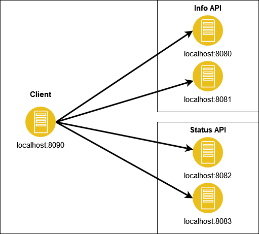

= Spring Feign Client with load balancing and two servers over SSL.

This project is living example of creating Spring Client supported by Feign and Spring load balancer with example Info API Server and Status API Server.

Client connects sequentially in random/round robin order with Info API or Status API. Both connections are encrypted by SSL with generated public/private key pair by `keytool` tool.

Both clients generates HTTP 500 by some occurences. You can modify code to check if retryer/timeouts works properly.

Below is represented architecture.

== Technology stack

Technology stack used in project:

* Spring:
** Open Feign client
** Load balancer
** Security bundle
* Java 11
* Apache components
* Maven

== Build and run project

You can use built in maven wrapper by typing `mvnw clean package` or simply `mvn clean package` with version `3.6.3`. You can see three artifacts:

* ./server/info/target
* ./server/status/target
* ./client-feign/target

You can start info/status server with `java -jar  server-XXXX-0.0.1-SNAPSHOT.jar --spring.config.location=application.yaml --server.port=XXXX`, where:

* --spring.config.location==application.yaml is location of current configuration. You can copy file from target/class with keystore and fix keystore path in config like a `key-store: ./info.p12`.
* --server.port=8081 is server port number. You must specify port, when you want to reach multiple instances

Client is very similar, open `/client-feign/target` and type: `java -jar client-feign-0.0.1-SNAPSHOT.jar --spring.config.location=application.yaml --server.port=8090`, obviously you must config `application.yaml` with truststore from `classes` folder and rename truststore path.

So, for sake of our test case, run:

* Info-Server on port 8080, 8081.
* Status-Server on port 8082, 8083.
* Client on port 8090.

Now, open Postman collection in `doc` folder and try to send message to client or directly to specific server.

You can generate keys on Windows/Linux (it's very similar without deleting certs) with `generate_keys.bat` and change it for each endpoint.